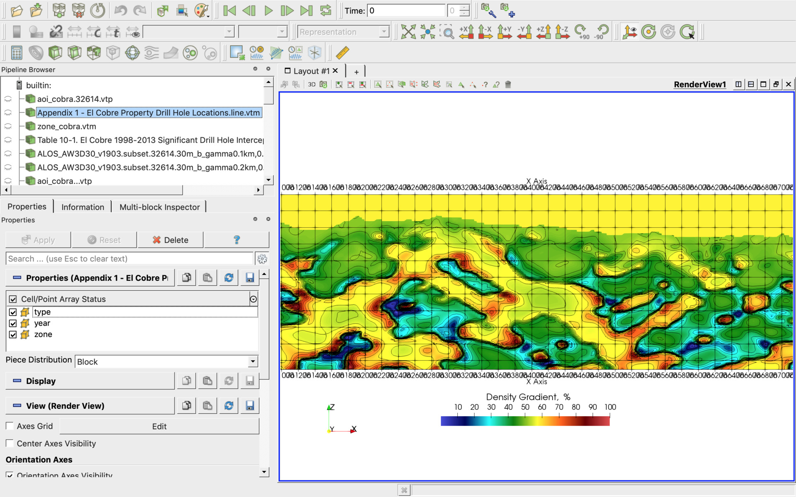
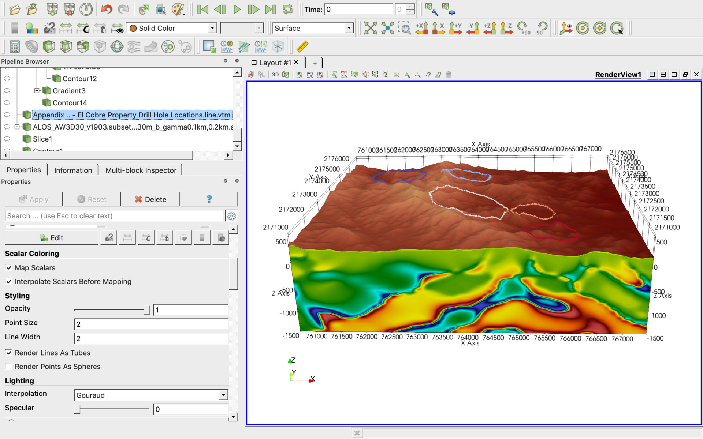
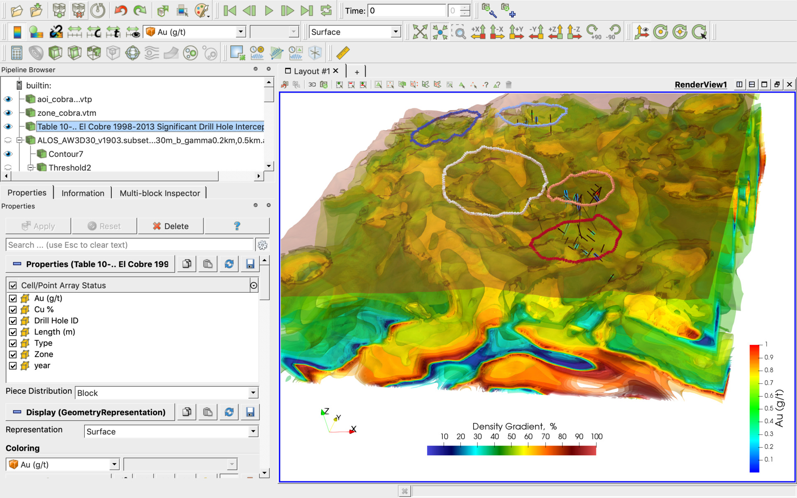
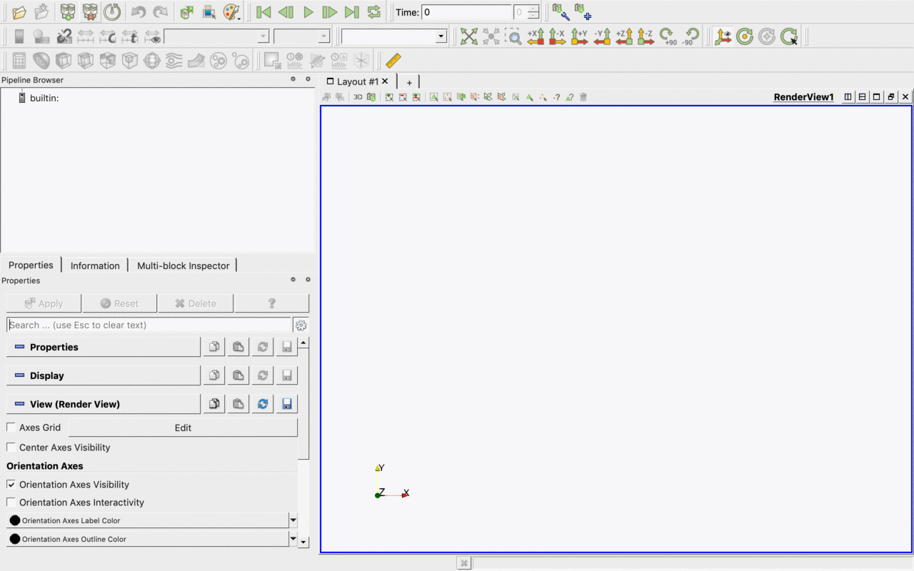

# ParaView-ElCobreMexico
[ParaView](https://www.paraview.org/download/) project for geological exploration on El Cobre Property, Veracruz, Mexico

See LinkedIn posts for more details:

[Full 3D Density Model](https://www.linkedin.com/posts/activity-6608289329049550848-O7DY/)

[Sample of the 3D Density Model](https://www.linkedin.com/posts/activity-6608613026637586432-TdM-/)

[Cross section for 3D model with band-pass filter 200-500m](https://www.linkedin.com/posts/activity-6608647570707234816-oFAF/)

[Cross section for 3D model with band-pass filter 100-200m](https://www.linkedin.com/posts/activity-6608691551159754752-p7CT/)

# How it looks

There are multiple data cubes and sections in the project which could be enabled manually. See below the initial view screenshot:

# How to open the project

Use [ParaView](https://www.paraview.org/download/) File -> Load State menu item to load the project.pvsm project file and specify "data" subdirectory as "Data Directory" as on the screen below:

